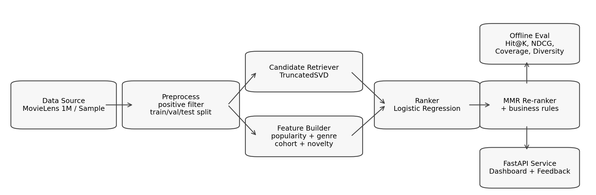

# CineMatch: 영화 개인화 추천 시스템

CineMatch는 영화 추천 시스템을 처음부터 끝까지 한 번 직접 만들어보자는 생각으로 시작한 프로젝트입니다. 단순히 추천 점수만 계산하는 데서 끝내지 않고, **후보 생성 → 랭킹 → 다양성 재정렬 → 오프라인 평가 → API 서빙**까지 한 흐름으로 묶었습니다.

이 저장소는 크게 두 가지 용도로 쓰도록 만들었습니다.
- 샘플 데이터로 바로 돌려보는 데모 버전
- MovieLens 1M으로 학습/평가해 보는 포트폴리오 버전



## 프로젝트에서 한 일
- 사용자-아이템 상호작용 행렬을 기반으로 후보 생성
- 영화 메타데이터와 사용자 정보를 이용한 재랭킹
- MMR 기반 다양성 리랭킹
- 콜드스타트 추천
- 오프라인 평가 리포트 생성
- FastAPI 기반 추천 API와 간단한 대시보드
- SQLite 추천 로그 / 피드백 로그 저장
- Docker / unittest / GitHub Actions 정리

## 왜 이렇게 구성했는가
추천 시스템은 보통 한 번에 모든 아이템을 정교하게 점수화하기보다, 먼저 후보를 줄인 뒤 그 후보를 다시 정렬하는 방식이 실무에서도 많이 쓰입니다. 이 프로젝트도 그 흐름을 따라갔습니다.

현재 파이프라인은 아래 순서로 동작합니다.
1. **Candidate generation**: 상호작용 행렬에서 잠재 요인을 뽑아 비슷한 아이템 후보를 빠르게 찾습니다.
2. **Ranking**: 후보 점수에 장르 일치, 인기도, novelty, demographic feature 등을 더해 재정렬합니다.
3. **Reranking**: 상위 결과가 한 장르에 몰리지 않도록 MMR로 한 번 더 조정합니다.

완전히 복잡한 딥러닝 추천 모델은 아니지만, 포트폴리오에서는 오히려 이 정도 구조가 설명하기 좋고 디버깅도 쉽다고 판단했습니다.

## 데이터셋
기본 실행은 synthetic sample 데이터로 가능합니다.

실제 포트폴리오용 평가는 MovieLens 1M을 기준으로 하도록 스크립트를 넣어두었습니다. 다만 MovieLens 1M은 재배포 제약이 있어서 저장소 안에 원본 파일을 포함하지 않았고, 다운로드 스크립트만 제공합니다.

## 빠르게 실행해보기
### 1. 환경 준비
```bash
python -m venv .venv
source .venv/bin/activate
pip install -r requirements.txt
```

### 2. 샘플 데이터로 실행
```bash
make seed-sample
make train-sample
make smoke
make run
```

브라우저에서 확인:
```text
http://127.0.0.1:8000
```

### 3. MovieLens 1M으로 실행
```bash
make download-ml1m
make train-ml1m
make export-report
make run
```

## 자주 쓰는 명령어
```bash
make seed-sample        # synthetic sample 생성
make train-sample       # sample 데이터 학습 + 평가
make download-ml1m      # MovieLens 1M 다운로드
make train-ml1m         # MovieLens 1M 학습 + 평가
make export-report      # latest report -> docs/sample_eval_report.html
make run                # FastAPI 실행
make smoke              # end-to-end smoke test
make test               # unittest 실행
make clean              # 산출물/로그 정리
```

## API 예시
### 기존 사용자 추천
```bash
curl "http://127.0.0.1:8000/users/1/recommendations?top_k=10&diversity_lambda=0.88"
```

### 콜드스타트 추천
```bash
curl -X POST "http://127.0.0.1:8000/cold-start/recommendations" \
  -H "Content-Type: application/json" \
  -d '{"age_bucket":"25-34","gender":"F","favorite_genres":["Drama","Romance"],"top_k":10}'
```

### 피드백 저장
```bash
curl -X POST "http://127.0.0.1:8000/feedback" \
  -H "Content-Type: application/json" \
  -d '{"user_id":"1","item_id":"50","event_type":"click","value":1}'
```

## 평가 방식
현재 리포트는 최소 3개 모델을 같이 비교합니다.
1. `Popularity`
2. `Latent Retriever`
3. `Final Multi-Stage`

이렇게 둔 이유는 최종 모델 숫자만 보여주는 것보다, baseline 대비 얼마나 나아졌는지 설명하기가 훨씬 쉽기 때문입니다.

지표는 아래를 사용합니다.
- Precision@K / Recall@K / HitRate@K
- MAP@K / MRR@K / NDCG@K
- Catalog Coverage / Novelty / Diversity / Personalization / Long-tail share

리포트 파일은 여기 생성됩니다.
- `storage/reports/evaluation_report_<dataset>.html`
- `storage/reports/evaluation_report_<dataset>.json`
- 제출용 샘플: `docs/sample_eval_report.html`

## 모델링 메모
### 후보 생성기
상호작용 행렬에 대해 `TruncatedSVD`를 적용해 latent factor 공간을 만들었습니다. 대규모 환경용 ANN 인덱스나 딥 retrieval 모델까지는 가지 않았고, 현재 프로젝트 규모에서는 이쪽이 더 간단하고 재현성이 좋았습니다.

### 랭커
랭커는 후보 생성 단계 점수에 영화/사용자 메타데이터를 조합한 feature를 붙여 `Logistic Regression`으로 학습합니다. 너무 화려한 모델보다, feature가 어떻게 반영됐는지 설명 가능한 구성이 필요해서 이렇게 잡았습니다.

### 다양성 리랭킹
정확도만 따라가면 추천 결과가 비슷한 장르로 몰려서, 마지막에 MMR을 적용했습니다. 이 단계는 데모에서도 체감이 잘 되는 편이라 프로젝트 설명용으로도 좋았습니다.

## 폴더 구조
```text
cinematch_personalized_recommender/
├── app/
├── data/
│   └── sample/
├── docs/
├── scripts/
├── tests/
├── storage/
├── Dockerfile
├── docker-compose.yml
├── Makefile
└── README.md
```

## 로컬 검증
아래 항목은 로컬에서 직접 확인했습니다.

- `python -m unittest discover -s tests -v`
- `python scripts/smoke_test.py`
- sample 데이터 기준 학습 / 평가 / 리포트 생성

검증 기록은 [`docs/validation_report.md`](docs/validation_report.md)에 정리해 두었습니다.

샘플 평가에서는 `Final Multi-Stage`가 baseline보다 높은 `HitRate@10`, `NDCG@10`, `MRR@10`을 보였습니다. 다만 이 숫자는 sample 기준이라, 실제 포트폴리오에서는 MovieLens 1M 결과를 같이 제시하는 편이 훨씬 설득력 있습니다.

## 제한 사항
현재 버전에서 아직 안 넣은 것도 있습니다.

- 실시간 온라인 학습
- 세션 기반 추천
- 딥러닝 기반 retrieval / ranking 모델
- 대규모 ANN 인덱스
- A/B 테스트 환경

즉, 지금 저장소는 “추천 시스템 구조를 끝까지 구현하고 설명할 수 있는 버전”에 가깝습니다.

## 같이 보면 좋은 문서
- [포트폴리오 소개글](docs/portfolio_intro_ko.md)
- [이력서 bullet](docs/resume_bullets.md)
- [데모 스크립트](docs/demo_script.md)
- [면접 Q&A](docs/interview_qa.md)
- [GitHub 업로드 가이드](docs/github_publish_guide.md)
- [샘플 평가 리포트](docs/sample_eval_report.html)
- [최종 제출 체크리스트](docs/final_submission_checklist.md)
- [검증 기록](docs/validation_report.md)

## 라이선스 및 데이터 참고
- 코드: MIT License
- MovieLens 데이터셋은 저장소에 포함하지 않았습니다. 사용 시 GroupLens의 배포/사용 조건을 확인해 주세요.
